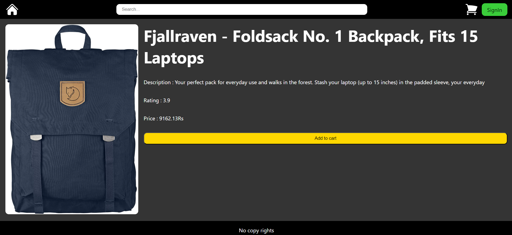
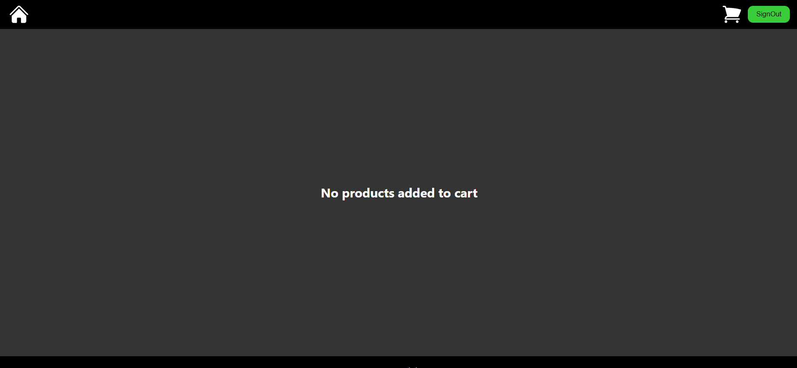
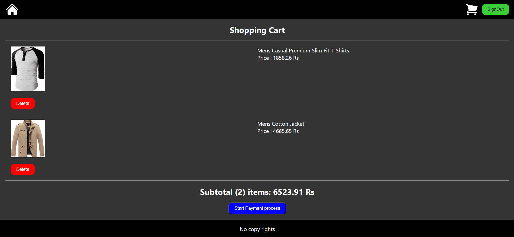
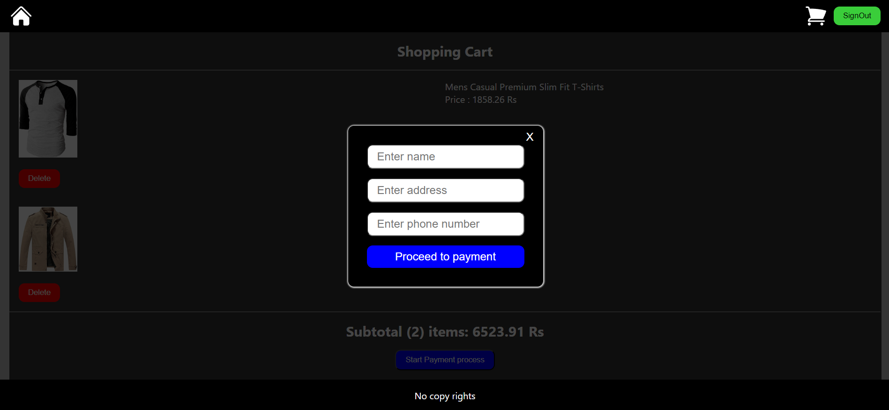
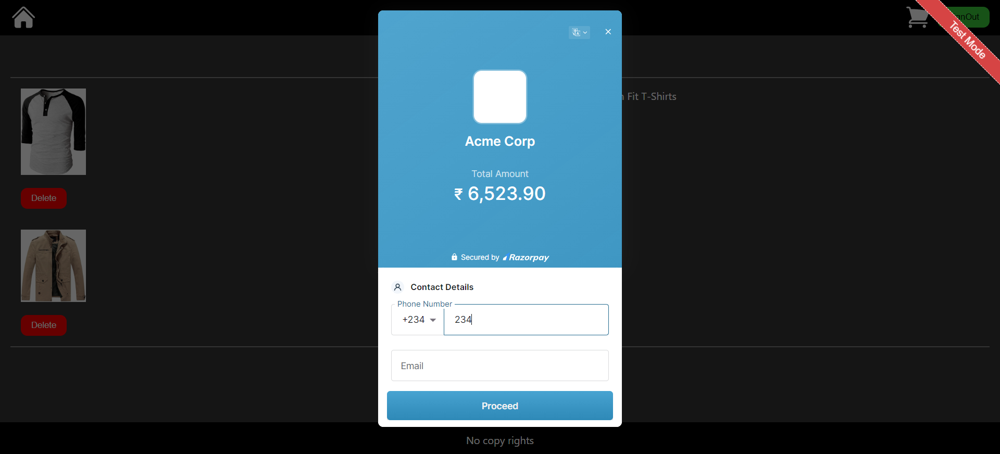
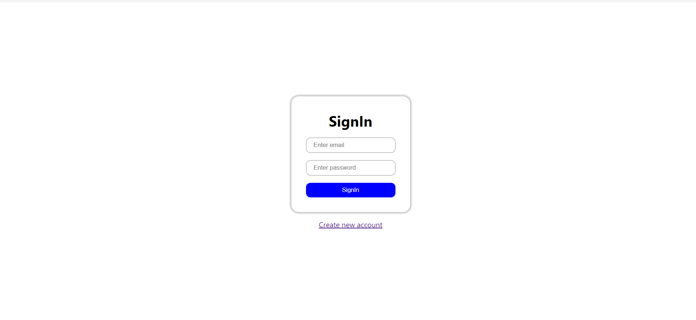
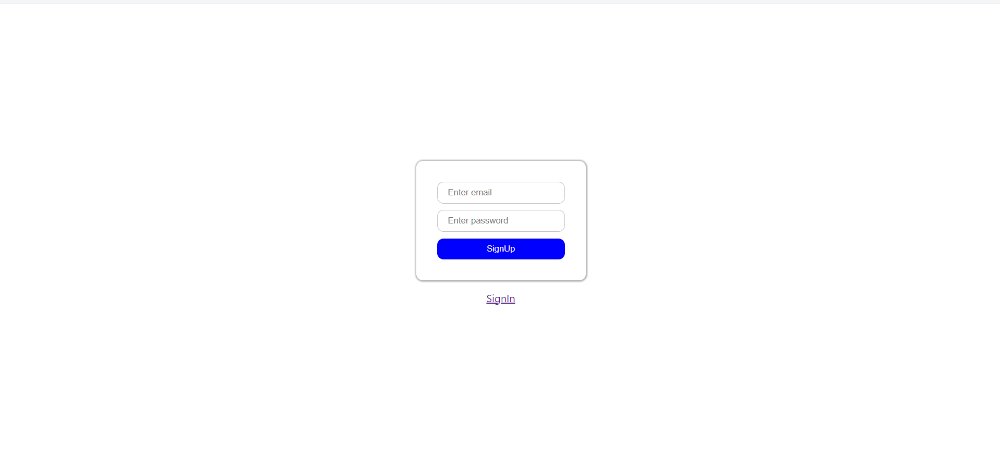

# Basic Ecommerce Application

## Installation

### Step 1

Run the below code in the terminal
```shell
npm i
```

### Step 2

Make a **.env** file in the project folder.
<br>
Inside the **.env** file you need to create the following 
<br>
REACT_APP_FIREBASE_API_KEY = *Put your firebase api key here*
<br>
REACT_APP_FIREBASE_AUTH_DOMAIN = *Put your firebase auth domain here*
<br>
REACT_APP_FIREBASE_MESSSAGE_SENDER_ID = *Put your firebase message sender id here*
<br>
REACT_APP_FIREBASE_APP_ID = *Put your firebase app id here*
<br>
REACT_APP_FIREBASE_MEASURMENT_ID = *Put your firebase measurement id here*
<br>
REACT_APP_RAZOR_PAY_ID = *Put your razor pay test id here*
<br>
REACT_APP_RAZOR_PAY_SECRET_KEY = *Put your razor secret key here*

Click [here](https://firebase.google.com/?hl=en&authuser=0) to go reach **Firebase** 
<br>
Click [here](https://razorpay.com/) to go reach **Razor pay**

## Tech Stack

### Core Technologies
- HTML/CSS
- JS/ES6
- Node/npm
- React

### Frontend libraries and tools

- Redux Toolkit
- React Router DOM
- Axios
- Firebase
- React Hot Toast

## Pages

### Home Page


The home page is where you will first visit when going to the app. From here you can search for among the products that are available at the time in the store.
<br>
If one clicks on top of any of the products the site will open a new page containing the details of the product you have clicked on.
<br>
The **Add to cart** button will let a user add the particular item to there cart.When you add an item to the cart that doesnt already exist in the cart then a toast will inform you of that the items has been added to the cart. If you click on the button after adding the item to cart already then a toast message will let you know that the item already exist in the cart.
<br>
You can singIn to your account by clicking on the SignIn button. Once you have signedIn the button will change to a the SignOut button, that will let you signout of your acount.

### Product Details Page



This page shows the details of the products.The add to cart button in this page does the same functions as the one you see on the home screen.

### Cart Page

This is the page that will show all the items that you are interested in buying at the time.

#### Cart page when not signedIn to any account


This will be how the UI looks when a user has yet to sign in to an account

#### Cart page when signedIn with no items added to cart



This will be the UI when the user has signed in but has yet to add any item to the cart.

#### Cart page when signedIn with items added to cart



This will be the UI when a user has added some items to the cart.
<br>
In the cart the items added will be shown as cards. Each card can be deleted and the curresponding item will be removed from your cart

#### Cart page when the start payment process button is pressed



This modal window will open when you click on the start payment process button in the cart page. This window is used to get information that will be used in the payment process.All the fields are necessary in this modal window if anyone presses the Proceed to payment button without filling any of the fields a toast will inform them that all the fields are required to proceed to next step of payment.

#### Cart page when proceed to payment button is pressed



The Razor pay integartion page that is being run on the test mode.From here you can do the rest of the things required for the payment

### SignIn page



This is the signIn page where users can login to their accounts. Once you have signedIn successfully the app will redirect you to the home page of the site

### SignUp page



This is the signUp page from where users can create accounts to login to the app. Once you have successfully created an acount you will be redirected to the signIn page so that you can singIn to your acount.

